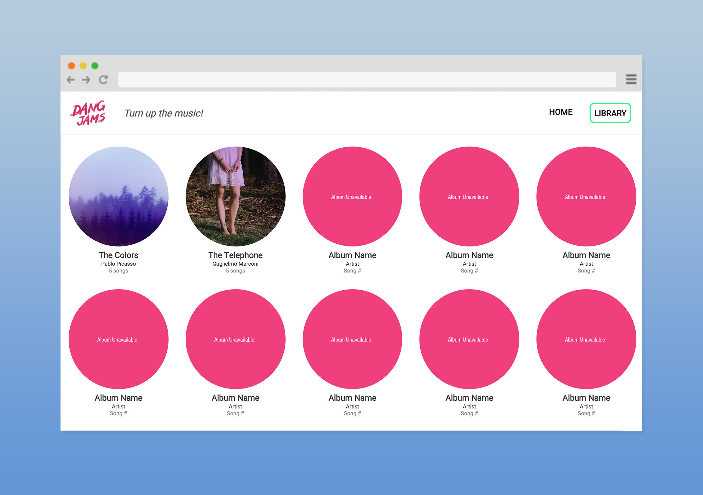

# React Jam

A React based music player with music albums and it's list of songs.

[Demo](https://react-jam-music-player.herokuapp.com/) - _Allow a few seconds for the server to start up._

## Table of contents

- [General info](#general-info)
- [Screenshots](#screenshots)
- [Technologies](#technologies)
- [Setup](#setup)
- [Features](#features)
- [Todo](#todo)
- [Status](#status)
- [Contact](#contact)

## General Info

This is a personal project to understand the usage of react-router in React..

## Screenshots

## Technologies

- React 16.6.1
- React Router 4.3.1

## Setup

This project was bootstrapped with [Create React App](https://github.com/facebook/create-react-app).

### `npm start`

Runs the app in the development mode. 
Open [http://localhost:3000](http://localhost:3000) to view it in the browser.

The page will reload if you make edits. 
You will also see any lint errors in the console.

## Features

- Album list
- Song List
- HTML Audio player

## Todo

- Repurpose css

## Status

- _complete_

## Contact

- by [@taidang](https://dangarts.com) - feel free to contact me!
